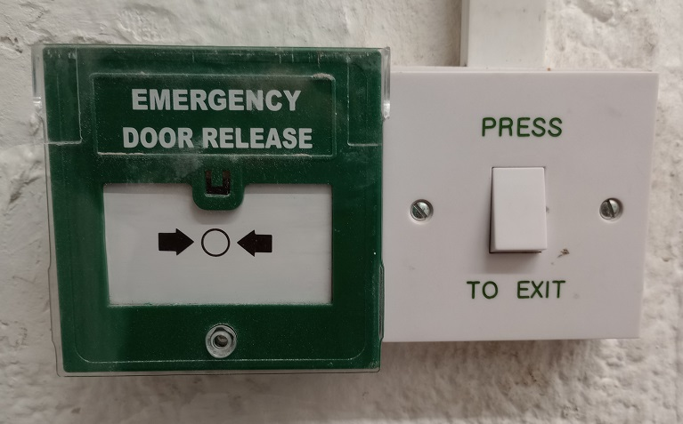

Health and Safety
=================

Health & Safety is the responsibility of every member of Bristol Hackspace. It is the duty of each member to make sure they are safe and not endangering the people around them.

First Aid
---------

First Aid Boxes are kept stocked and checked periodically. Please ensure you are familiar with where these are stored - they can be found in the following locations:

* Corridor downstairs next to the main entrance.
* By the divider curtain between the wood and metal shop.

If you use anything from these boxes, please report the injury using the accident reporting form explained below.

Accident and Near Miss Reporting
--------------------------------

It is important that accidents, whether resulting in an injury or near miss, are logged. This helps us improve the safety of the hackspace. It guides our induction processes and prompts us to check the first aid kits more regularly than scheduled.

Incidents can be reported using our online `Safety incident reporting form <https://bristolhackspace.org/safetyreport>`__.

Fire
----

What to do in the Event of a Fire
^^^^^^^^^^^^^^^^^^^^^^^^^^^^^^^^^

* Power down the machine you are using.
* Leave immediately via one of the escapes. Do not stop to collect personal belongings.
* Warn others in the space as you leave.
* Raise the alarm, if it is not already sounding, by pressing a red break-glass.
* Once outside, phone the fire brigade. Our alarm is not automatically linked to them.

Fire Escapes
^^^^^^^^^^^^

There are two fire escapes from Hackspace. These are:

* The main entrance / front door
* The door at the back of the Main Room

Fire Alarm Break-Glasses
^^^^^^^^^^^^^^^^^^^^^^^^

Red Break-glasses which sound the fire alarm are located:

* Between the inner and outer front doors to Hackspace
* Beside the fire escape at the back of the Main Room
* In the CNC Room

Resetting the Fire Alarm
^^^^^^^^^^^^^^^^^^^^^^^^

If the fire alarm is sounding and you think it is a false alarm, you can reset it using the control panel. The control panel is located in the cupboard under the stairs between the inner and outer front doors to Hackspace.

To reset the alarm:

* Locate the red plastic key stored on top of alarm panel, insert it into the panel, and turn
* Press the red button labelled “1”
* Press the green button labelled “2”
* Remove the key and put it back on top of the panel

The alarm system is shared with the tenants above us, so do not assume it is a false alarm just because Hackspace isn't on fire. Check upstairs too!

Emergency Front Door Release
^^^^^^^^^^^^^^^^^^^^^^^^^^^^

The both the inner and outer front doors to hackspace are normally opened via a electronic switch. If these switches fail to release the door in an emergency, you can disable the door locking system by pressing the green break-glass next to the door. Pressing a green break-glass will not set off the building's fire alarm.

Fire Extinguishers
^^^^^^^^^^^^^^^^^^

There are fire extinguishers located beside each fire escape and beside the laser cutter. If you feel confident in doing so, you can use these to tackle a very small fire.